# Trivium

> Udviklet af: Thomas, Morten, Rune og Victoria

---

## Indholdsfortegnelse

- [Links](#links)
- [Login til test-brugere](#login-til-test-brugere)
- [Tech Stack beskrivelse](#tech-stack-beskrivelse)
- [Kendte issues](#kendte-issues)
- [Manglende features](#manglende-features)
- [Database og bruger-autorisering](#database-og-bruger-autorisering)
- [Interne designbeslutninger og argumentation](#interne-designbeslutninger-og-argumentation)
- [Eksempler på GitHub issues (analyse og planlægning)](#eksempler-på-github-issues-analyse-og-planlægning)
- [Eksempler på Pull Requests (code review og forbedringer)](#eksempler-på-pull-requests-code-review-og-forbedringer)
- [Arbejdsproces](#arbejdsproces)
- [ER Diagram](#er-diagram)
- [Opsummering og refleksion](#-opsummering-og-refleksion-post-mortem)

## Links

- **Frontend**: <https://trivium.lol>
  - Omdirigerer til:
    <https://trivium-proj-lineup.vercel.app/>
- **Backend API**: <https://trivium.lol/api>
- **Projekt board**:
  <https://github.com/orgs/eaaa-dob-wu-e25a/projects/17>

## Login til test-brugere

- John Pork:
  - Email: `john@pork.com`
  - Password: `password123`

## Tech Stack beskrivelse

- Backend: `node.js` REST API
  - Backend står for kontakt med Postgres
    databasen hos Supabase. Frontend sender
    `fetch` requests til backend, som så
    gemmer/henter osv fra database
  - De fleste endpoints er sikret med en
    middleware, der forkaster requests uden en
    `Authorization` header og valid JWT token. Vi
    validerer tokens hos Supabase
  - Vi bruger følgende dependencies m.m.:
    - `express.js`
    - `cors`
    - `postgres`
    - `uuid`
    - `@supabase/supabase-js`
    - `commander`
    - `morgan`
    - `winston`
    - `zod`
- Frontend: `next.js` app med server-side
  rendering

  - **Tailwind CSS**  
    Utility-first CSS framework, der muliggør hurtig og konsistent styling direkte i JSX uden behov for separate CSS-filer.  
    Valgt for høj udviklingshastighed, god performance og nem vedligeholdelse.

  - **FlyonUI**  
    Komponentbibliotek bygget oven på Tailwind CSS, som leverer prædesignede og responsive UI-komponenter (fx modals, buttons og cards).  
    Har gjort det muligt at udvikle komplekse komponenter markant hurtigere og sikre et ensartet visuelt udtryk.

  - **Lucide**  
    Letvægts ikonbibliotek med konsistente, SVG-baserede ikoner.  
    Anvendes til at skabe et klart og genkendeligt visuelt sprog på tværs af applikationen.

---

## Implementeret features

Nedenfor ses en oversigt over de centrale features, der tilsammen udgør LineUp MVP’en.  
Fokus har været på klar onboarding, tydelig navigation og et solidt fundament for networking og samarbejde i musikbranchen.

---

### Onboarding flow - Primær udvikler: Victoria og Rune

Onboarding introducerer brugeren til LineUps kerneidé og primære funktioner på en hurtig og letforståelig måde.  
Flowet er designet til at give overblik uden at overvælde og skabe en klar forventning til platformens formål.

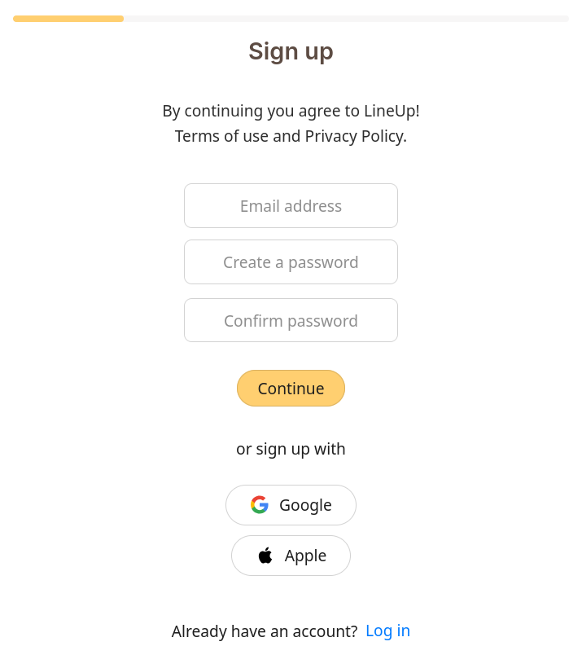

---

### User profil - Primær udvikler: Morten

Brugerprofilen fungerer som en kombination af **CV og portfolio**.  
Her kan brugere præsentere deres rolle, kompetencer, genre og tidligere arbejde, hvilket skaber transparens og tillid mellem aktører på platformen.

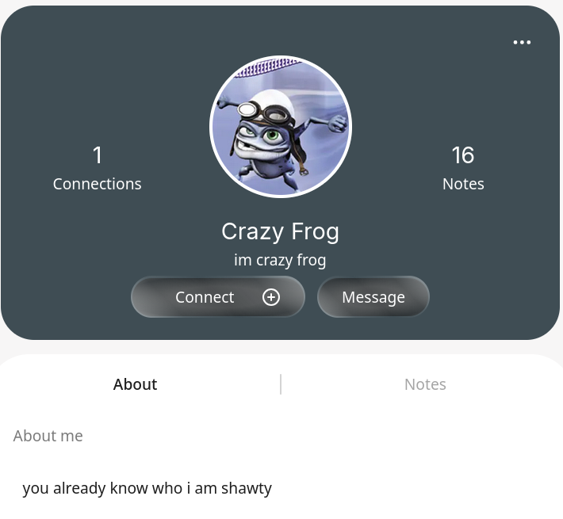

---

### User feed - Primær udvikler: Morten

Feedet samler relevant aktivitet fra platformen og fungerer som et socialt omdrejningspunkt.  
Her kan brugere følge med i deres connections' gigs og arbejde.

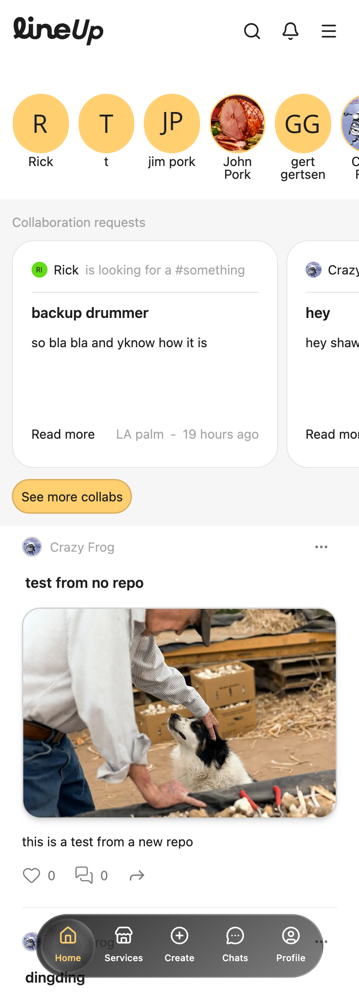

---

### Services - Primær udvikler: Victoria og Morten

Services-siden giver overblik over de ydelser og kompetencer, som brugere og virksomheder tilbyder.  
Formålet er at gøre det nemt at finde specifikke services og skabe kontakt på baggrund af konkrete behov.

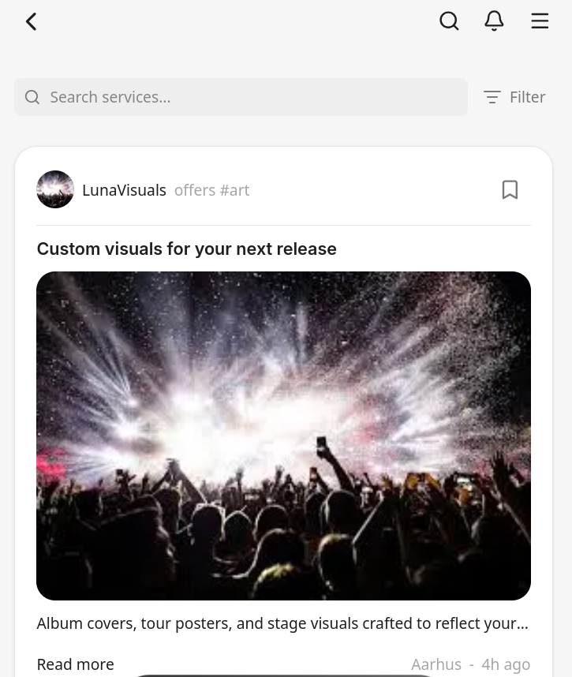

---

### Create (Requests & collaborations) - Primær udvikler: Rune(frontend) og Thomas(backend)

Create-siden er omdrejningspunktet for at oprette nye requests og samarbejder.  
Brugeren guides gennem en struktureret proces, hvor formål og deltagere tydeliggøres fra start.

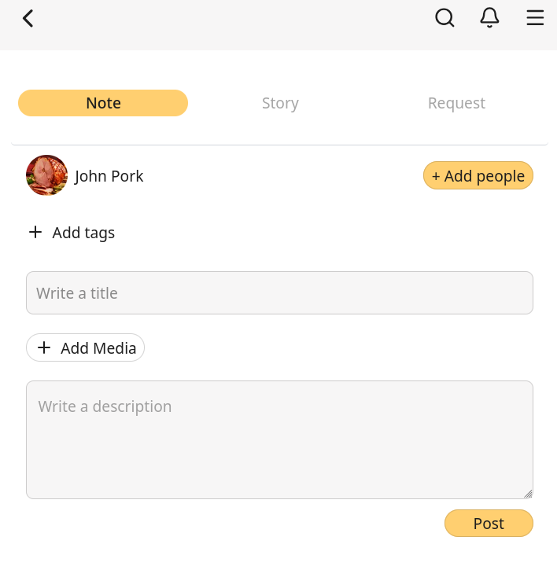

---

### Chats - Primær udvikler: Victoria

Chats giver mulighed for direkte kommunikation mellem brugere og understøtter samarbejde efter en connection er etableret.  
Løsningen er holdt simpel for at sikre hurtig og effektiv dialog.

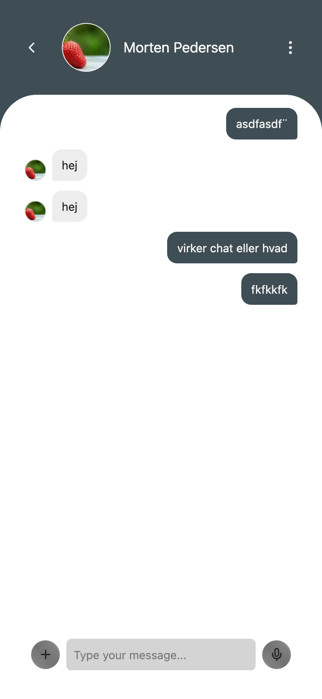

---

### Search - Primær udvikler: Victoria

Søgefunktionen gør det muligt at finde relevante brugere, services og requests.  
Søgningen er central for platformens networking-formål og understøtter hurtig discovery.

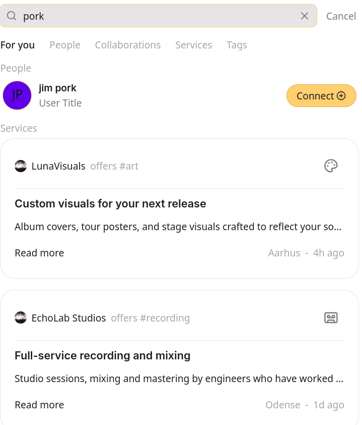

---

### Navigation - Primær udvikler: Victoria og Rune

Navigationen er designet mobile-first og sikrer hurtig adgang til platformens kernefunktioner.  
Strukturen er konsistent på tværs af views og skalerer op til desktop uden at miste overblik.

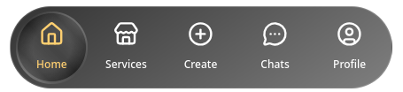

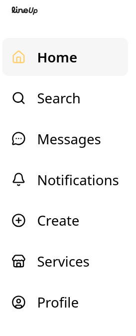

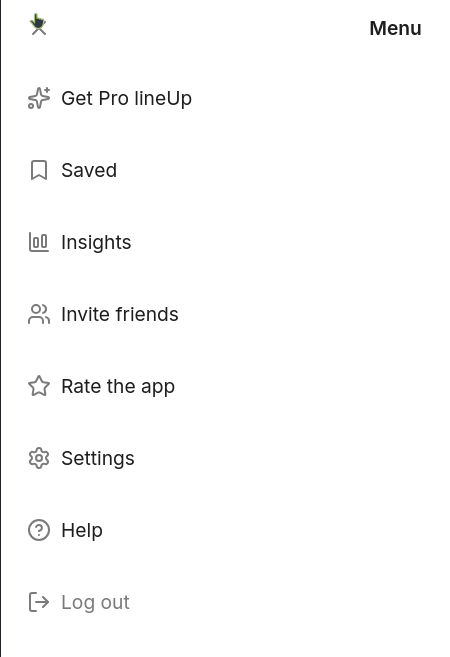

- **Mobile-first design with desktop mode**

### Desktop design

- Desktop-layoutet er designet særskilt og er ikke blot en opskalering af mobil-udgaven.
- Målet har været at bevare samme indhold som på mobil, men præsentere det på en mere overskuelig og desktop-venlig måde.
- Dette har krævet supplerende designbeslutninger ud over Figma-prototypen.

## Kendte issues

- **Login tjek**
  - Vi har en fungerende redirect til `/login` i
    frontend, når brugeren ikke er logget ind, men
    pga vores Supabase opsætning kunne vi ikke få
    det til at ske server-side, så der er et kort
    "content-flash" inden man lander på
    login-formularen.
- **Login Desktop**
  - Lige nu bliver desktop nav vist på login og onboarding, dette er en issue som skal løses.
- **Following/connections**
  - Vi har fejl og mangler i vores
    following-system som det er nu. I designet er
    der lagt op til, at "connections" er en
    to-vejs following, altså hvis bruger A følger
    bruger B, gælder det samme omvendt. Til det
    har vi lavet en "pending-state" når man
    anmoder om at følge andre, men vi har endnu
    ikke funktionalitet til at godkende følgning.
- **Backend request-validering**
  - I enkelte endpoints har vi brugt Zod som
    løsning på at få valideret den input, der
    sendes til backend. Da man bør anse alt data i
    en backend request som upålidelig er det
    vigtigt den bliver valideret før den fx gemmes
    i databasen, ellers er der stor risiko for at
    vi gemmer invalid data eller crasher backenden
    helt. Zod genererer også en liste over
    valideringsfejl, der kan gøre det nemmere at
    implementere fejlbeskeder i frontend.

## Manglende features

Nedenstående features er identificeret som enten delvist implementerede eller ikke fuldt færdiggjort inden for projektets tidsramme.

### Onboarding – user information

Onboarding-flowet tilpasser sig brugerens valg af rolle for at indsamle relevante oplysninger.

- **Del 4:** Brugeren vælger rolle

  - _I am a musician_
  - _Not a musician_

- **Del 5 (Musician):**  
  Hvis brugeren vælger _musician_, guides vedkommende videre til et signup-flow målrettet musikere, hvor der indsamles personlige oplysninger såsom fornavn, efternavn m.m.

- **Del 5.1 (Not a musician):**  
  Hvis brugeren vælger _not a musician_, guides vedkommende i stedet til et signup-flow målrettet virksomheder/andre aktører, hvor der indsamles virksomhedsrelaterede oplysninger såsom business name m.m.

Flowet sikrer, at brugeren kun præsenteres for relevante felter baseret på den valgte rolle.

### Chat

- Chat-funktionaliteten er implementeret og understøtter både private beskeder og gruppechats.
- Det er dog på nuværende tidspunkt **ikke muligt at oprette nye chats** (hverken private eller gruppechats) via brugergrænsefladen.
- Funktionaliteten er teknisk forberedt, men mangler det afsluttende UI-flow.

### Services

- Services-featuren anvender i øjeblikket **hard-coded data i frontend**.
- Der er endnu ikke implementeret kobling til backend eller database.
- Featuren fungerer derfor primært som et visuelt og konceptuelt proof-of-concept i MVP’en.

## Database og bruger-autorisering

- Vi bruger Supabase som vores database-provider,
  og samtidig til vores bruger-autorisering.
  - Supabase har et indbygget bruger-system
    (`auth.users`), hvori vi opretter brugere. Ved
    siden har vi vores egen bruger-tabel med data
    til brugernes personlige profil
    (`public.users`), hvor primary key matcher
    primary key i den tilsbarende Supabase bruger.
- Vores backend har en forbindelse til Supabase
  gennem deres sql transaction pooler. Vi bruger
  også Supabase's JS library til at verificere
  brugernes JWT-token når de laver
  backend-requests.
- Vores frontend bruger også Supabase's JS library
  til at oprette nye brugere og til authorization,
  bl.a. for at få en ny JWT token når brugere
  logger ind.

## Arbejdsproces

Vi har haft en moderat struktureret, men agil arbejdsproces. Projektet har ikke været opdelt i formelle sprints, men er i stedet blevet drevet iterativt, hvor vi løbende har vurderet fremdrift, mangler og prioriteringer med fokus på at levere en velfungerende MVP.

### Planlægning og opgavestyring

- Vi har anvendt **GitHub Issues** til at beskrive opgaver og features.
- Issues er blevet organiseret i et **Kanban board** via GitHub Projects.
  - For at skabe overblik og prioritering er issues blevet suppleret med **labels** (fx feature, bug, frontend, backend) samt **milestones** knyttet til projektets overordnede faser.
- Arbejdsfordelingen er primært sket gennem fysiske møder, hvor vi i fællesskab har prioriteret opgaver ud fra MVP-scope og tidsramme.
- Derudover har vi anvendt et eksternt værktøj, **Notion**, til at dele og vedligeholde intern dokumentation.
  - Notion har været særligt nyttigt til at samle og opdatere **reference til `.env`-konfigurationer** (fx variabelnavne og struktur), så alle arbejdede med samme opsætning. Derudover har værktøjet været brugt til dokumentation af workflows samt noter fra interne standups.

### Udviklingsworkflow

- For hver feature er der oprettet et issue med en kort, konkret beskrivelse.
- Udviklere har selv assignet sig til issues for at skabe ejerskab.
- Udvikling er som udgangspunkt foregået på **feature branches**.
- Når en feature var færdig, blev der oprettet en **Pull Request** mod vores `dev`-branch.
- Pull Requests er blevet brugt til code review og kvalitetssikring før merge.

### Code review og værktøjer

- Code reviews er primært udført manuelt af teamet.
- I enkelte tilfælde har vi benyttet **GitHub Copilot** som et assisterende værktøj til code review og forbedringsforslag.

### Afvigelser fra workflow

- Ved mindre ændringer eller simple bug fixes er der i enkelte tilfælde arbejdet direkte i `dev`-branchen.
- Disse afvigelser er vurderet acceptable for at opretholde momentum i projektets afsluttende fase.

Samlet set har arbejdsprocessen givet en god balance mellem struktur og fleksibilitet, samtidig med at den har understøttet hurtig iteration og løbende kvalitetssikring.

## Interne designbeslutninger og argumentation

Vi har overordnet set holdt os tæt op ad det udleverede Figma-design og det tilhørende design system. Vores tilgang har været at respektere de eksisterende stilistiske valg og sikre en så tro implementering som muligt.

Da projektet er udviklet uden løbende kundekontakt, har vi bevidst valgt **ikke** at foretage større ændringer i look-and-feel. Dette for at undgå at introducere designbeslutninger, som potentielt kunne afvige fra kundens intentioner og visuelle identitet.

Nogle af de mindre designbeslutninger er truffet med udgangspunkt i kendte UX-principper frem for personlige præferencer.

Eksempelvis er størrelsen på knapper og klikbare elementer optimeret til mobil, for at mindske risikoen for fejltryk og forbedre brugervenligheden.
Dette er baseret på Fitts’ Law, som beskriver, at større og tættere placerede klikmål er hurtigere og mere præcise at ramme – særligt på touch-enheder.

### Overvejelser og potentielle forbedringer

Undervejs i udviklingen har vi identificeret enkelte områder med forbedringspotentiale:

- **Breadcrumbs / navigationskontekst**  
  Vi har overvejet at tilføje breadcrumbs eller anden visuel kontekst, så brugeren tydeligere kan se, hvor i applikationens hierarki de befinder sig.  
  I visse flows kan det være uklart, om brugeren befinder sig på en nested side eller et selvstændigt view.

Denne forbedring er ikke implementeret i MVP’en, da den ikke fremgår af Figma-designet, men den er noteret som et oplagt næste skridt i en videreudvikling af løsningen.

## Eksempler på GitHub issues (analyse og planlægning)

### Feature: Create & edit chats

https://github.com/eaaa-dob-wu-e25a/sem-proj-trivium/issues/86

Dette issue illustrerer vores tilgang til analyse og planlægning af en feature.  
 Feature’en er markeret som en **“nice to have”**, da vi bevidst har prioriteret andre kernefunktioner i MVP’en først.

Issue-beskrivelsen indeholder:

- En klar og kort beskrivelse af den **ønskede funktionalitet**
- En liste over **feature behaviours**, der specificerer hvordan funktionen forventes at opføre sig
- **Acceptance criteria**, som definerer hvornår feature’en kan betragtes som færdigimplementeret
- Supplerende noter med fokus på **user experience**, herunder overvejelser om modal-flow og brugerinteraktion

Denne struktur har gjort det muligt at afklare scope, vurdere kompleksitet og prioritere feature’en korrekt, selvom den ikke blev implementeret i den nuværende iteration.

### Task: Create new note, story and request component

https://github.com/eaaa-dob-wu-e25a/sem-proj-trivium/issues/95

Dette issue er implementeret og efterfølgende lukket.  
 Issue’et viser vores tilgang til konkret opgaveløsning og kravspecificering på komponentniveau.

Issue-beskrivelsen indeholder:

- En kort og præcis **beskrivelse af opgaven**, herunder formålet med komponenten
- En specifikation af de **data og props**, komponenten skal understøtte (fx genre, paid/unpaid status og location)
- Et **refererende screenshot** af det ønskede UI, anvendt som visuel guideline under implementeringen
- En liste over **requirements / acceptance criteria**, som definerer hvornår opgaven kan godkendes

Denne struktur har sikret fælles forståelse af opgaven, reduceret misforståelser under implementeringen og gjort det tydeligt, hvornår tasken var klar til review og lukning.

## Eksempler på Pull Requests (code review og forbedringer)

### Create page – top create selector (note, story, request)

https://github.com/eaaa-dob-wu-e25a/sem-proj-trivium/pull/128

Dette Pull Request illustrerer vores brug af code reviews som en aktiv del af udviklingsprocessen.  
 PR’en indeholder konstruktive kommentarer med forslag til forbedringer af kodekvalitet, struktur og læsbarhed samt begrundelser for, hvorfor ændringerne bør foretages.

Derudover viser PR’en:

- Dialog omkring forbedringsforslag direkte i koden
- Efterfølgende **implementering af anbefalede ændringer**
- Bekræftelse og opfølgning, når forslag er blevet håndteret

Pull Requesten fungerer som et konkret eksempel på, hvordan vi har anvendt code reviews til at forbedre kvaliteten af løsningen og sikre fælles ejerskab over kodebasen.

### Implement search overlay with API integration and recent searches (peer review, Copilot review og faglig vurdering)

https://github.com/eaaa-dob-wu-e25a/sem-proj-trivium/pull/112

Dette Pull Request demonstrerer vores brug af både **peer review** og **GitHub Copilot review** som en del af kvalitetssikringen.

PR’en indeholder:

- Feedback fra teammedlemmer med fokus på struktur, logik og brug af API
- Automatiske forslag fra Copilot, som er blevet vurderet kritisk

Nogle forslag blev bevidst fravalgt, da de primært omhandlede mindre stilistiske eller præferencebaserede ændringer uden væsentlig indflydelse på funktionalitet eller ikke passede til projektets kontekst og arkitektur. Dette har krævet faglig vurdering frem for blind accept af automatiske forslag.

Derudover indeholder PR’en forslag til test og validering inden oprettelse af Pull Request.  
 Under review-processen opstod der en mindre misforståelse omkring brugen af `user.role`, hvilket blev taget op i fællesskab og afklaret gennem dialog og justering af implementeringen.

Pull Requesten viser dermed både teknisk samarbejde, kritisk brug af AI-værktøjer og fælles problemløsning i praksis.

## ER Diagram

- Vi bruger Supabase som vores
  database-provider, og samtidig til vores
  bruger-authentication.
- Vores backend har en forbindelse til
  Supabase gennem deres sql transaction
  pooler. Vi bruger også Supabase's JS library
  til at verificere brugernes JWT-token når de
  laver backend-requests.
- Vores frontend bruger også Supabase's JS
  library til at oprette nye brugere og til
  authorization, bl.a. for at få en ny JWT
  token når brugere logger ind.
- ER dagrammet som vi har brugt er lavet i ERD plus og derefter har Supabase genereret en ud fra vores Database

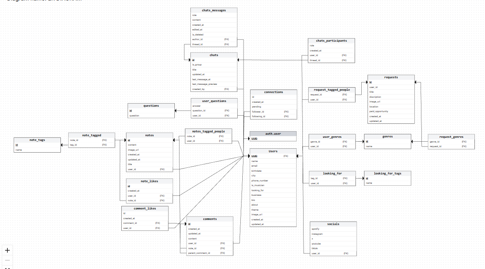

## Opsummering og refleksion (Post-mortem)

Overordnet set har projektet været en god og lærerig proces, hvor vi har fået omsat et omfattende koncept og et hi-fi Figma-design til en fungerende, deployet MVP.

### Hvad fungerede godt

- Brug af **GitHub Issues og Pull Requests** har givet et godt overblik over features, ansvar og progression.
- Pull Requests har gjort det nemmere at reviewe kode og sikre en mere stabil kodebase.
- Arbejdsdelingen omkring konkrete features har gjort det muligt for hver deltager at tage ejerskab fra analyse til implementering.
- Den tekniske stack og arkitektur har fungeret stabilt og understøttet hurtig udvikling.

### Hvad vi ville gøre anderledes

Selvom vi har benyttet **GitHub Projects** til projektstyring, ser vi et klart forbedringspotentiale i, hvordan vi organiserer og følger op på arbejdet.

- Projektstyring bør være mere eksplicit og struktureret, især i et team hvor nogle arbejder bedst alene og andre i tæt samarbejde.
- **Kommunikation er afgørende** og bør prioriteres højere — særligt når størstedelen af arbejdet foregår remote.
- Ændringer i fælles kode kræver tydelig kommunikation; selv mindre justeringer eller bugfixes bør meldes ud til resten af teamet.
- Flere faste check-ins eller korte statusopdateringer kunne have mindsket misforståelser og dobbeltarbejde.

> **Communication is key** — både i de store arkitektoniske beslutninger og i de små detaljer.

Samlet set har samarbejdet fungeret godt, men projektet har tydeligt vist, hvor vigtigt det er at kombinere tekniske værktøjer med klare aftaler, løbende dialog og fælles ansvar for fremdrift.

